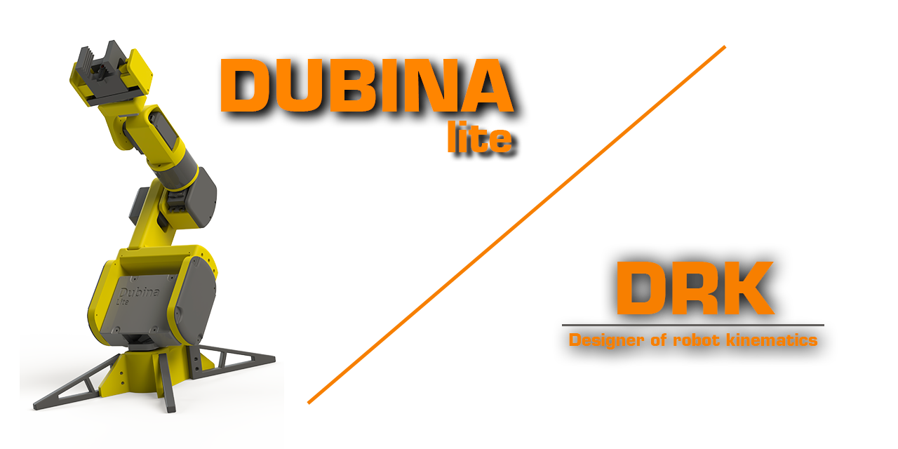
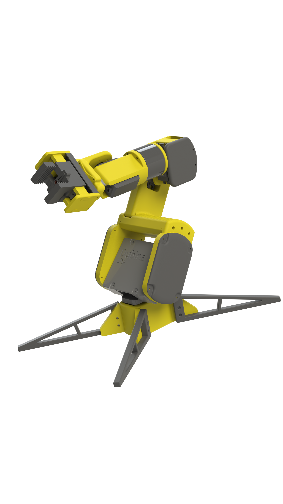
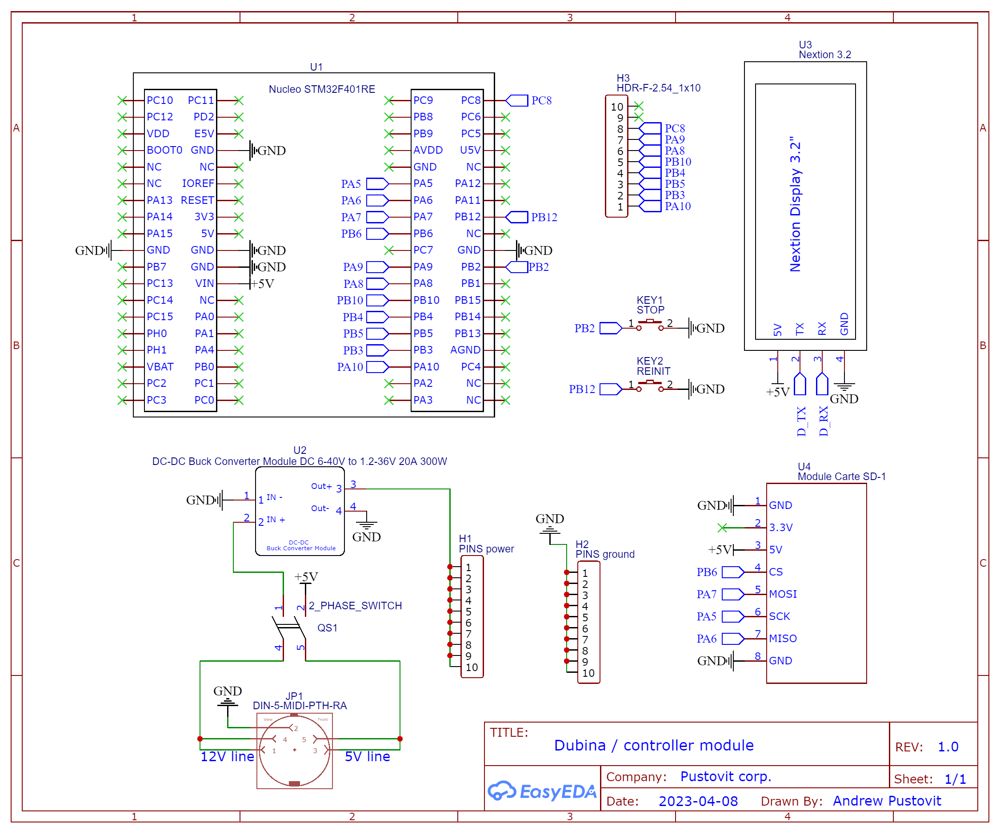

<p align="center">
  <a href="https://github.com/AndrewPst/Manipulator_6Dof_DUBINA_Lite">
    
  </a>

  <h1 align="center">Desktop robot manipulator</h1>

  <p align="center">
    Automate your desktop!
  </p>
</p>

-----

<div align="center">

  <a>Go to [DRK](https://github.com/AndrewPst/DRK-designer_of_robot_kinematics) / Go to [Dubina OS](https://github.com/AndrewPst/Manipulator_6dof_gcode_os)</a>

  
    

</div>


## Table Of Contents

* [About the Project](#about-the-project)
* [Built With](#built-with)
* [Getting Started](#getting-started)
* [Usage](#usage)
* [License](#license)
* [Authors](#authors)

## About The Project



This is a project of a desktop robot manipulator. Included with it is the program "DRK" - a developer of robot kinematics.

Project features:

* Control using "GCODE" commands
* Availability of the inverse kinematics algorithm
* 6 degrees of freedom

Program the robot yourself using the "DRK" program! Management is available both directly from the computer and from the SD card. You can simulate the robot's movements to debug the trajectory.

Design your robot's body yourself or use ready-made models.

## Built With

**DRK** created with:
* [Qt Framework](https://www.qt.io/)
* [MinGW-W64 g++ 12.2 compiler](https://www.mingw-w64.org/)
* [C++17](https://ru.wikipedia.org/wiki/C%2B%2B17)

---

**STM32 Program** created with:
* [PlatformIO](https://platformio.org/)
* [MbedOS](https://os.mbed.com/)
* [VS Code](https://code.visualstudio.com/)

## Getting started

Assemble the robot, focusing on the [models](/3DModel) and diagrams in the project.



Familiarize yourself with the installation of the components of the project ([DRK](https://github.com/AndrewPst/DRK-designer_of_robot_kinematics) and [STM32 Program](https://github.com/AndrewPst/Manipulator_6dof_gcode_os))

## Usage

* Adjust the size of the robot;

<details>

<summary>Enter the values in the Denavit–Hartenberg parameter table</summary>


</details>

---

* Set the robot's position;

<details>

<summary>Use forward or reverse kinematics</summary>


</details>

---

* Create a robot movement algorithm

<details>

<summary>Combine different commands</summary>


</details>

---

* Simulate the robot's operation and check the correctness of your program;

<details>

<summary>You can customize the camera and add new projections</summary>


</details>

---

* Export your program to ".gcode" file;

<details>

<summary>Use the auto-restore function of parameters or add additional commands to the fields</summary>


</details>

---

* Move the file to the sd card and start its execution;

```gcode
   M32 /sd/<filename>.gcode
```

## License

Distributed under the Apache-2.0 License. See [LICENSE](/LICENSE) for more information.

## Authors

* **Andrew Pustovit** - *Comp Sci Student* - [AndrewPst](https://github.com/AndrewPst) - *DRK & 3D-models & STM32 program*
